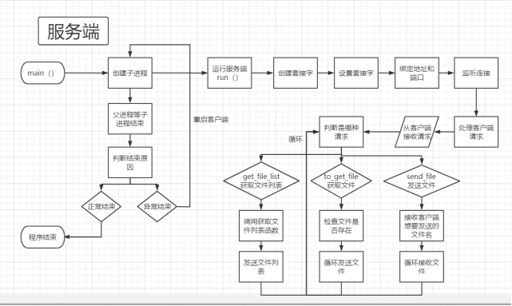
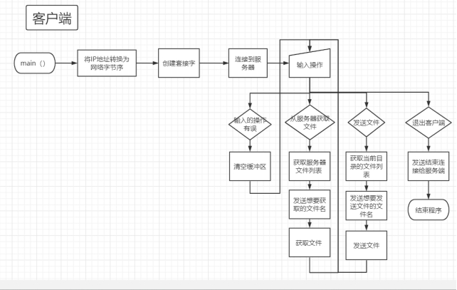

<div >

# OrangeNas

<br>

<div>
    
</div>
<div>
    
</div>
<div>
    
    
    
</div>
<br>

[简体中文](README_ZH.md) | [English](README_EN.md)


计网实验，文件传输系统

客户端和服务端均在 Linux 环境下运行

<br>

</div>

## 功能特性

- 实现一个FTP协议的客户端和服务端，完成基本的文件传输功能。
- 多客户端访问。
- 在获取文件之前能够先得到文件列表。

<br>

## 文件结构

- assets => 资源文件
- doc => 存放开发相关文档
- Src => 存放源代码
- bin => 编译出的二进制文件

<br>

## 软件架构





## 系统架构

Linux

<br>

## 快速开始

### 构建

克隆本项目

```shell
git clone git@github.com:Skeeser/OrangeNas.git
```


<br>

### 运行

#### 服务端使用：

1. 将 Src 目录下的 server 文件夹放到服务端主机上

2. 修改 server.c 中的端口号（默认为 8888），最大客户端数量（默认为 10），文件缓冲区大小（默认为 1024）；不修改则跳过这步。

3. 在 server 目录下，用命令行运行：

   ```shell
   make
   ./server
   ```

   即可运行服务端程序


#### 客户端使用：

1. 将 Src 目录下的 client 文件夹放到客户端主机上

2. 修改 client.c 中的服务端的 IP（默认与服务端在同一台主机），端口号（默认为 8888，要与服务端一致），文件缓冲区大小（默认为 1024）；不修改则跳过这步。

3. 在 client 目录下，用命令行运行：

   ```shell
   make
   ./client
   ```

   即可运行客户端程序


### 测试

server 文件夹、client 文件夹都放了测试文件，可以根据程序进行测试。


<br>

## 使用指南

- 开启客户端前要开服务端
  <br>

## 如何贡献

如果你碰巧看见这个项目, 想要参与开发

可以查看这个文档 [如何参与开源项目](doc/github参与开源项目流程.md)

<br>

## 关于作者

keeser

<br>

## 许可证

MPL 2.0
